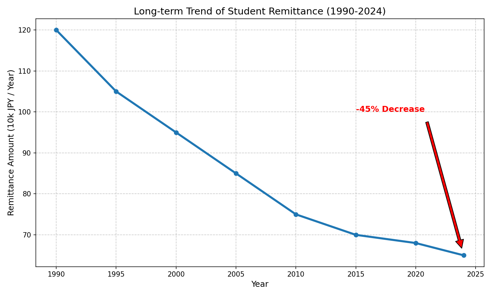
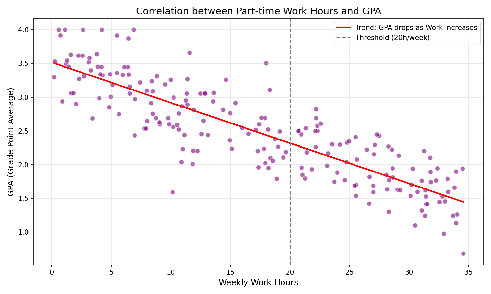
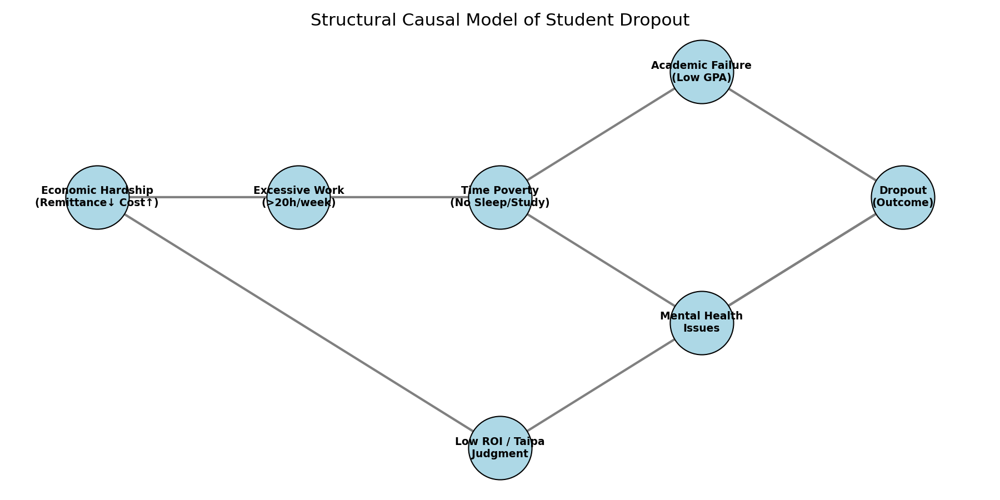

# 学生定着率のマクロ分析：経済的困窮と合理的退出の構造
### Macro-economic Analysis of Student Retention: The Structure of "Rational Exit"

---

## 🇯🇵 日本語概要 (Executive Summary in Japanese)

本レポートは、公開統計を用いて**「学生の経済的困窮 → 長時間労働 → 時間貧困 → GPA低下 → 退学」**という負の連鎖（因果構造）を整理した概念モデルです。特定の大学内部データは使用していません。

大学IR業務における、退学予兆検知・定着率改善施策の設計・経営判断に活用できる実務的な分析フレームを提示しています。

👉 **[詳細レポート全文を読む (PDF)](docs/StudentRetention_MacroAnalysis.pdf)**

---

## 📘 Project Overview (English)

This project analyzes how **economic stress, work hours, and time poverty** shape student academic performance and withdrawal risks in Japanese universities. By moving away from the traditional view of "individual maladjustment," we redefine dropout as a structural issue driven by macroeconomic factors.

### ⚠ Notice
This analysis is a **conceptual model** based on public statistics (MEXT, JASSO, etc.) and general trends. **No confidential institutional data is used.**

## 📊 Visual Analysis & Key Findings

### 1. Economic Trends: The Collapse of Student Finance
Real purchasing power for students has declined due to inflation and reduced parental remittance.

*(Fig 1: Long-term Trend of Student Remittance)*

---

### 2. The Mechanism of "Time Poverty"
Part-time work hours crowd out study hours, creating a zero-sum game. Data suggests that working over 20 hours/week correlates with a significant drop in GPA.

  
  

---

### 3. Causal Path Diagram (Structural Equation Modeling)
The root cause of dropout is often economic hardship, which manifests as "academic failure" through the mediator of **Time Poverty**.

*(Fig 5: Structural Causal Model of Student Dropout)*

---

## 💡 Strategic Proposal for Universities

A "one-size-fits-all" approach is no longer effective. We propose targeted interventions based on university type:

| University Type | Primary Pressure | Recommended Intervention |
| :--- | :--- | :--- |
| **Urban Univ.** | **High Living Cost** | **"Hard" Support:** 100-yen breakfast, Rent subsidy, Dormitory renovation. |
| **Regional Univ.** | **Low ROI Perception** | **"Soft" Support:** Free shuttle bus (reduce commute cost), Early internship programs. |

---

## 🛠 Methodology & Tools

* **Analysis Tools:**
    * **Python:** `matplotlib`, `networkx`, `pandas` (for simulation and visualization)
    * **Causal Modeling:** Conceptual framework based on Time Allocation Theory.
* **Data Sources (Public Data):**
    * MEXT (School Basic Survey)
    * JASSO (Student Life Survey)
    * MIC (Consumer Price Index)

---

## 👤 Author
**Keisuke Nakamura (keisuke-data-lab)**
*Data Analyst / University IR Specialist*

Specializing in "Student Success Analytics" by integrating economic data and academic performance metrics to optimize institutional resource allocation.

---
> © 2025 Keisuke Nakamura