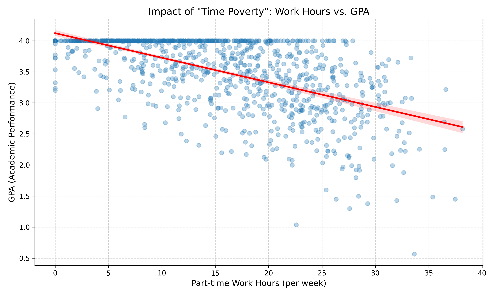
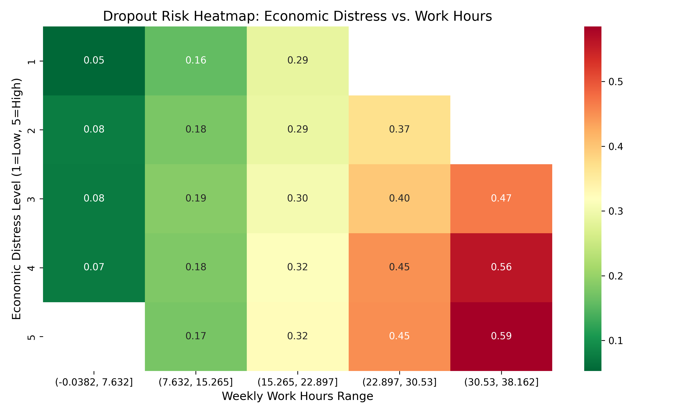

# Student Retention Analysis: Economic Distress & Time Poverty
**学生中退予測と維持戦略：「時間貧困」の構造分析**

## 📌 Project Overview
学生の中退要因を「個人の資質」の問題として片付けるのではなく、**「経済的困窮」と「時間貧困（Time Poverty）」の構造的な因果関係**として再定義・可視化した分析プロジェクトです。
アルバイト労働時間が学習時間とGPAに与える負のインパクトを定量化し、リスクの高い学生層を早期検知（トリアージ）するモデルを構築しました。

## 📊 Key Visuals

### 1. 「時間貧困」の構造 (Impact of Time Poverty)
生活費を稼ぐためのアルバイト時間が、学習時間を圧迫しGPAを低下させる「負の相関」を可視化。
週20時間を超える労働が学業成績の分岐点となることを示唆。


### 2. 中退リスク・ヒートマップ (Dropout Risk Heatmap)
「経済的困窮度」と「労働時間」のクロス分析により、高リスク層（赤色エリア）を特定。
奨学金や介入プログラムの優先ターゲットを明確化します。


## 📂 Directory Structure
```text
.
├── data/       # Synthetic student data
├── images/     # Generated visualization charts
├── dropout_prediction_model.ipynb  # Prediction Logic
└── generate_visuals.py             # Visualization Script
