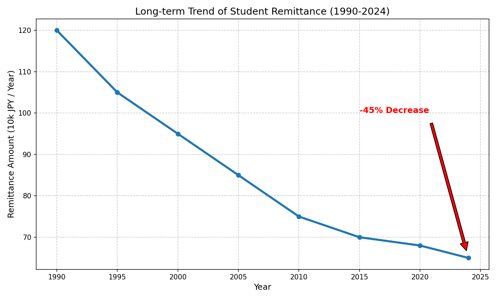
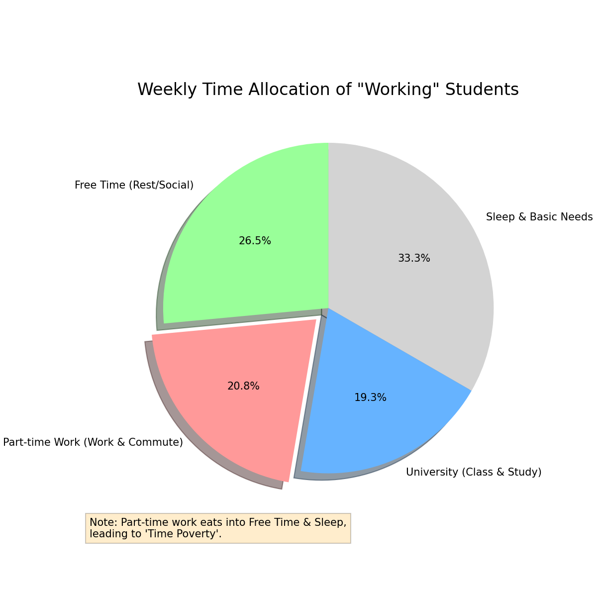
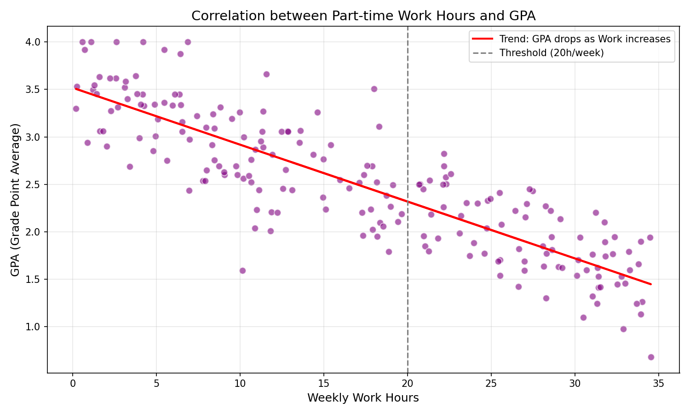
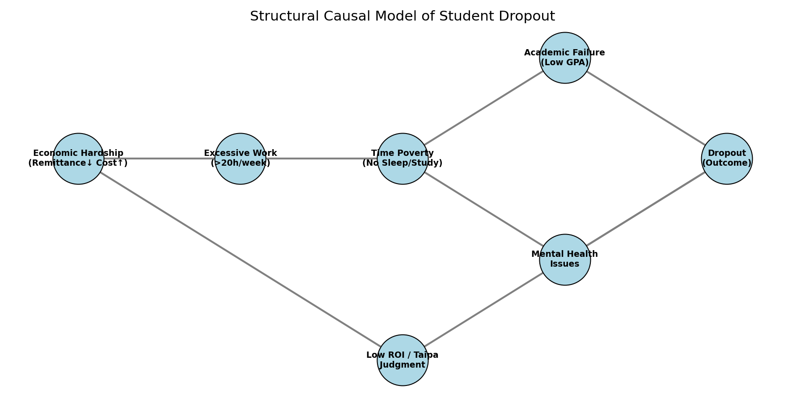

# 学生定着率のマクロ分析：経済的困窮と合理的退出の構造
### Macro-economic Analysis of Student Retention: The Structure of "Rational Exit"

---

## 📌 プロジェクト概要 (Executive Summary)

本プロジェクトは、近年増加傾向にある「学生の中途退学」の要因を、従来の「個人の資質・不適応」論から脱却し、**マクロ経済環境（インフレ・仕送り減）および大学財務の視点**から構造的に分析したものです。

学生が大学教育を「投資」と捉え、経済的困窮と時間貧困（Time Poverty）の果てに**「ROI（投資対効果）が合わない」と判断して損切り（退学）に至るメカニズム**を可視化しました。

👉 **[詳細レポート全文を読む (PDF)](docs/StudentRetention_MacroAnalysis.pdf)**

---

## 📊 分析結果の可視化 (Visual Analysis)

### 1. マクロ経済環境の変化：学生家計の崩壊
[cite_start]親世代の可処分所得低下により、仕送り額はこの30年で約4割減少しています [cite: 254]。一方で、学生生活のコスト（Student CPI）はインフレにより急騰しており、「収入減・支出増」のギャップが拡大しています。

*(Fig 1: Long-term Trend of Student Remittance)*

---

### 2. 「時間貧困」のメカニズム
[cite_start]経済的ギャップを埋めるための長時間労働（アルバイト）が、学生から「学ぶ時間」と「休む時間」を奪う**ゼロサムゲーム**が発生しています [cite: 308][cite_start]。週20時間を超える労働は、GPAの有意な低下と強い相関を示します [cite: 323]。

  
  

---

### 3. 構造的因果モデル (Causal Path Diagram)
[cite_start]退学の真因は「やる気がない（学業不振）」ではなく、**経済的困窮が時間貧困を経由して学修崩壊を引き起こす構造**にあります [cite: 345]。

*(Fig 5: Structural Causal Model of Student Dropout)*

---

## 💡 提言：大学タイプ別の介入戦略 (Strategic Proposal)

[cite_start]「全方位的なケア」はリソースの限界を迎えています。大学の立地特性に応じた**「選択と集中」**を提言します [cite: 245]。

| 大学タイプ | 最大の退学圧力 | 推奨される介入策 (Intervention) |
| :--- | :--- | :--- |
| **都市部大学** | **家賃・生活コスト** | **「生活コスト支援（ハード）」** ・100円朝食/夕食による食費支援と居場所作り ・大学寮のリノベーションと安価な提供 |
| **地方大学** | **通う意義 (ROI) の低下** | **「キャリア接続の可視化（ソフト）」** ・スクールバス無料化による通学コスト削減 ・地元企業インターンシップによる早期のROI提示 |

---

## 🛠 使用技術・データ (Tech Stack & Data)

* **Analysis & Visualization:**
    * **Python:** `matplotlib`, `networkx`, `pandas`, `numpy`
    * 因果連鎖の可視化（Causal Path Diagram）および統計データのトレンド分析
* **Reference Data (Simulation Source):**
    * 文部科学省「学校基本調査」
    * JASSO「学生生活調査」
    * 総務省「消費者物価指数 (CPI)」
    * *※本リポジトリのグラフは、上記公開統計のトレンド係数を基にPythonでシミュレーション生成したモデル図です。*

---

## 👤 Author
**Keisuke Nakamura (keisuke-data-lab)**
*Data Analyst / University IR Specialist*

- 経済データと学修データ（GPA等）を統合した「学生成功（Student Success）」の分析
- 退学リスクの早期発見モデルの構築
- 大学経営におけるリソース配分の最適化提案

---
> © 2025 Keisuke Nakamura